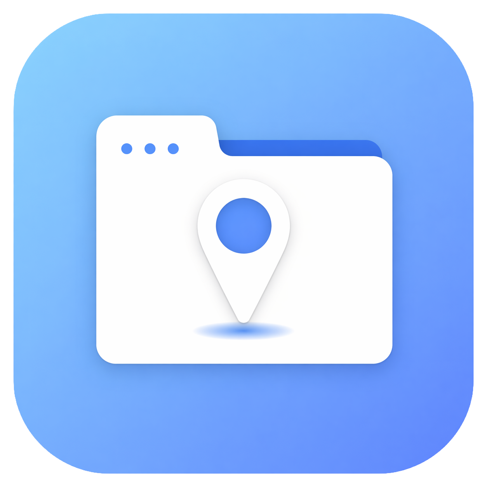
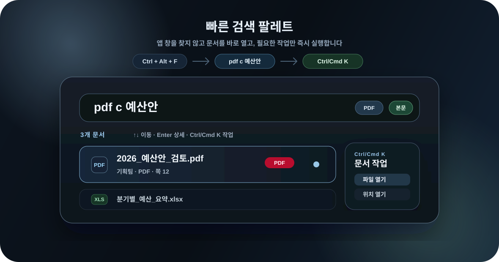
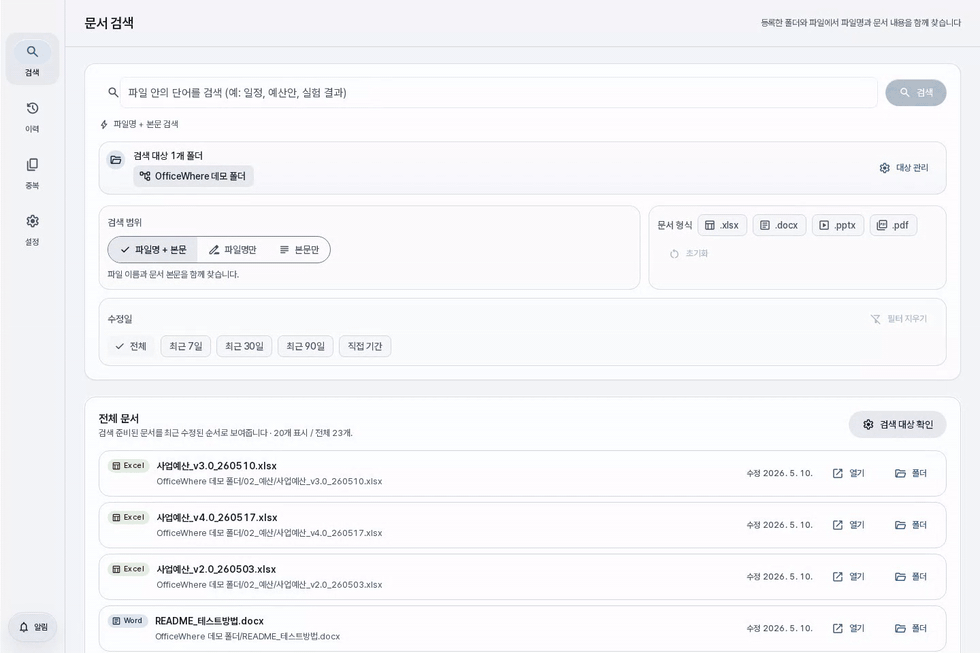
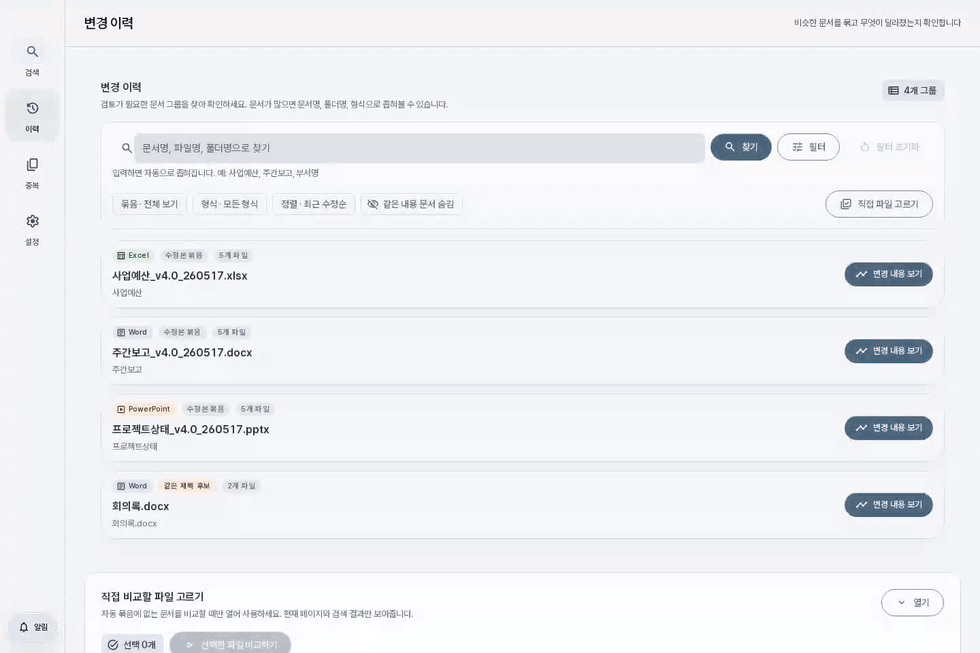
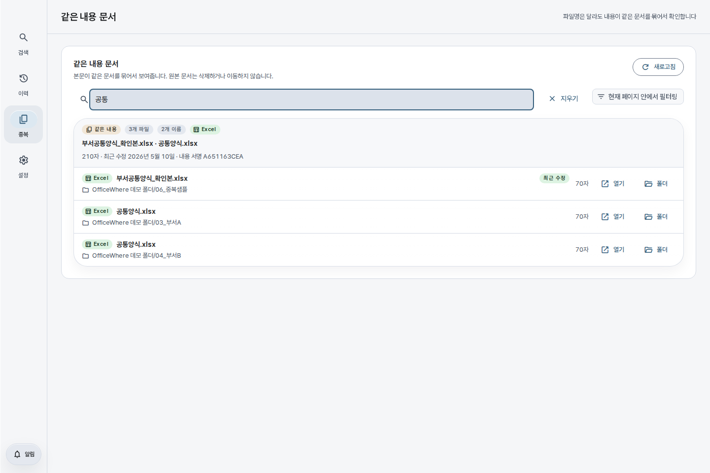

# OfficeWhere

<p align="center">
  
</p>

<p align="center">
  흩어진 Excel, Word, PowerPoint, PDF 문서를 <b>찾고</b>, 수정본의 <b>바뀐 내용</b>을 보고, 이름만 다른 <b>같은 내용 문서</b>를 확인하는 데스크톱 앱입니다.
</p>

<p align="center">
  <a href="../../releases">다운로드</a> · <a href="docs/README.md">문서</a> · <a href="docs/release-test-checklist.md">릴리스 체크리스트</a>
</p>


## 기능 미리보기

### 빠른 검색 팔레트



전역 단축키로 바로 띄우고, 결과만 빠르게 고른 뒤 `Ctrl/Cmd K`로 문서 작업을 실행합니다. [SVG 파일 열기](docs/assets/readme-quick-palette.svg)

### 문서 검색



파일명과 본문을 함께 찾아 문서별 결과를 확인합니다. [GIF 파일 열기](docs/assets/readme-demo-search.gif)

### 변경 이력



수정본 묶음에서 바뀐 셀과 내용을 빠르게 펼쳐봅니다. [GIF 파일 열기](docs/assets/readme-demo-version.gif)

### 같은 내용 문서



이름이 달라도 본문이 같은 문서를 한곳에서 확인합니다. [이미지 파일 열기](docs/assets/readme-demo-duplicates.png)

## 한눈에 보기

| 기능 | 할 수 있는 일 |
| --- | --- |
| 빠른 검색 팔레트 | 앱 창을 찾지 않고 전역 단축키로 문서를 검색하고, 파일 형식·본문 접두어와 작업 패널로 바로 엽니다. |
| 문서 검색 | 파일명뿐 아니라 Excel 셀, Word 문단/표, PowerPoint 슬라이드, PDF 텍스트 안의 단어까지 검색합니다. |
| 변경 이력 | 비슷한 이름의 수정본을 묶고 PPT 슬라이드, Word 문단, Excel 셀에서 바뀐 내용을 보여줍니다. |
| 같은 내용 문서 | 파일명은 달라도 본문이 같은 문서를 전용 페이지에서 묶음으로 확인합니다. |
| 원본 보호 | 원본 문서를 복사·수정·삭제하지 않고, 앱 데이터만 별도로 저장합니다. |

## 지원 파일

| 형식 | 검색 | 변경 이력 |
| --- | --- | --- |
| `.xlsx` | 셀 내용 | 셀 값 추가·삭제·수정 |
| `.docx` | 문단·표 | 문단·표 변경 |
| `.pptx` | 슬라이드·표 | 슬라이드·항목 변경 |
| `.pdf` | 페이지 텍스트 | 지원하지 않음 |

## 다운로드해서 실행

- Windows: `officewhere-vX.Y.Z-windows-x64.zip` 압축 해제 후 `OfficeWhere.exe` 실행
- macOS Apple Silicon: `officewhere-vX.Y.Z-mac-arm64.dmg` 또는 `.zip` 실행
- Linux 패키지는 아직 제공하지 않습니다.

> macOS에서 “앱이 손상되어 열 수 없습니다”가 뜨면 아직 서명/공증되지 않은 앱이라서 그렇습니다. 자세한 우회 방법은 [릴리스 체크리스트](docs/release-test-checklist.md)와 GitHub Release 설명을 참고하세요.

## 직접 실행 / 빌드

```bash
# 웹 개발 모드
./setup.sh
./dev-web.sh

# 데스크톱 패키지
./build.sh
```

Windows에서는 같은 순서로 `setup.bat`, `dev-web.bat`, `build.bat`을 사용합니다.

## 개발 참고

- 문서 목차: [`docs/README.md`](docs/README.md)
- 테스트 기준: [`docs/test-guidelines.md`](docs/test-guidelines.md)
- 릴리스 검증: [`docs/release-test-checklist.md`](docs/release-test-checklist.md)

## 라이선스

GPL-3.0-only. 자세한 내용은 [LICENSE](LICENSE)를 참고하세요.

PDF 텍스트 추출에는 PDFium 기반 `pypdfium2`를 사용합니다. OfficeWhere는 검색 색인을 위해 텍스트만 읽고,
원본 PDF를 저장하거나 수정하지 않습니다.
